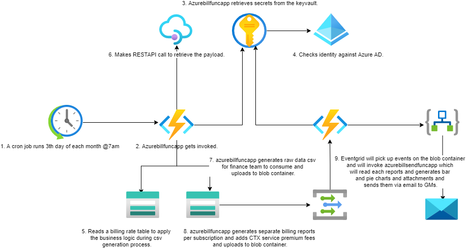
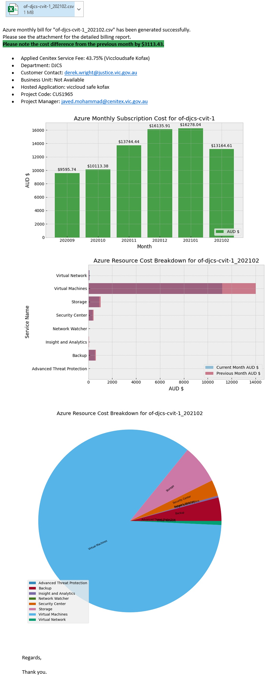

# VICGOV - Azure EA Billing Report Workflow
## 1. Introduction
### 1.1	Overview

As a result of outstanding Azure charges, Hosting Platform Services has been working with numerous Customer Account, Managers, Finance and Business technology teams to resolve a number of issues which have presented and have resulted in outstanding invoices under dispute with customers.

This document is intended to provide a high level overview of workflow how the automation captures and generates the bill.

Included in this report is a step by step detailed guide around where to look for troubleshooting.

## 2 Logical Architecture
### 2.1	Logical System Component Overview

1. A cron job runs 3th day of each month @7am (UTC 3rd day @ 8pm).
2. Azurebillfuncapp @GSPINFRA03 gets invoked.
3. Azurebillfuncapp @GSPINFRA03 retrieves secrets from the keyvault.
4. Checks identity against Azure AD.
5. Reads a billing rate table to apply the business logic during csv generation process.
6. Makes RESTAPI call to retrieve the payload. 
7. azurebillfuncapp generates raw data csv for finance team to consume and uploads to blob container.
8. azurebillfuncapp generates separate billing reports per subscription and adds CTX service premium fee and uploads to blob container.
9. Eventgrid will pick up events on the blob container and will invoke azurebillsendfuncapp which will read each reports and generates bar and pie charts and attachments and sends them via email to GMs.

## 3 Output Email
### 3.1	The example output as per below.
